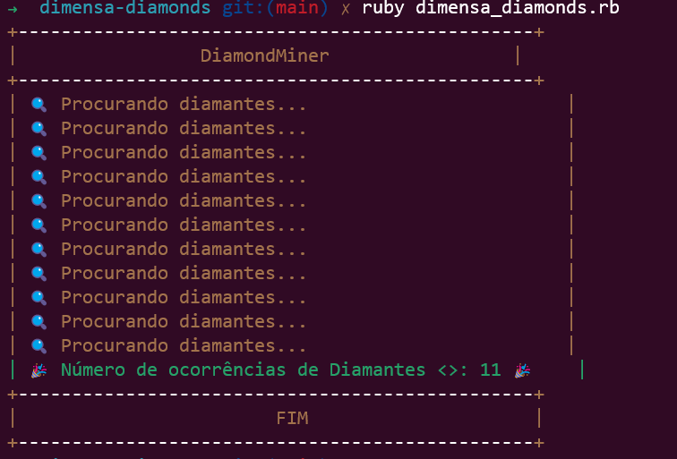

<p align="center">
  
 
</p>

<h1>Dimensa Diamonds</h1>

Dimensa Diamonds é um programa em Ruby que conta o número de diamantes em uma expressão dada.
O programa recebe uma expressão que contém diamantes (representados por "<>") e areia (representada por "."). Ele extrai os diamantes e retorna a quantidade total de diamantes extraídos.

<h2> Setup </h2>

Certifique-se de ter o Ruby instalado em seu ambiente.
<h3> Requisitos </h3>
- Ruby 3.1.3

<h3> Como clonar e rodar o programa :</h3>
<br>
 Clone o repositório para sua máquina local:

  ```
    git clone git@github.com:Jamal-CRF/Dimensa-Diamonds.git
  ```
  Navegue até o diretório do projeto:
  
  ```
    cd Dimensa-Diamonds
  ```
  Instale as dependências do projeto usando o Bundler:
    
  ```
    bundle install
  ```
  
  Execute o programa:

  ```
    ruby dimensa_diamonds.rb
  ```
  voce verá a execeução do programa assim:
  <p align="left">
    
  </p>
 
  Para executar os testes:

  ```
    rspec
  ```

  Os testes serão executados e você verá o resultado no terminal.

Certifique-se de que todas as gemas necessárias foram instaladas corretamente antes de executar os testes.

<h2> Contribuição </h2>
Contribuições são bem-vindas! Se você encontrar algum problema, tiver alguma sugestão de melhoria ou quiser adicionar novos recursos, sinta-se à vontade para abrir uma issue ou enviar um pull request.

<h2> Autor</h2>


<p>Developed by <a href="https://www.linkedin.com/in/lucasaraujomouta/">Lucas Araujo</a>.</strong></p>


<h2> 📝 Material de apoio</h2>

<p><a href="https://leanpub.com/conhecendo-ruby"> Lvro - Conhecendo Ruby </a></p>
<p><a href="https://www.ruby-lang.org/pt/"> Ruby </a></p>
